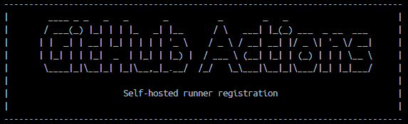
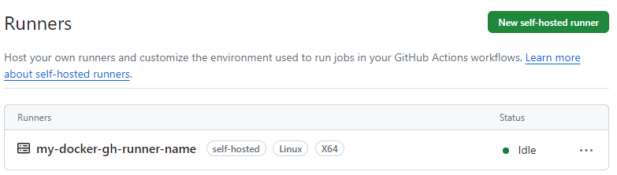

# Docker GitHub Actions self-hosted runner
Containerized GitHub Actions self-hosted runner via Docker



# 00. Create GitHub Actions self-hosted runner
## Add a new self-hosted runner


- go to your repo > Settings > Actions > Runners > Click "New self-hosted runner"
- look under the "Configure" section, and note your github runner token

# 01 Pull Docker Image
```
docker pull michaelakridge326/github-actions-sh-runner
```

# 02 Use Docker Run CMD
```
docker run -d \
  --name my-github-runner \
  -e GH_RUNNER_URL=https://github.com/your_repo_here \
  -e GH_RUNNER_TOKEN=your_gh_runner_token_here \
  -e GH_RUNNER_NAME=my-docker-gh-runner-name \
  -v runner_work:/actions-runner/_work \
  michaelakridge326/github-actions-sh-runner
```
## OR 02.a - Alt Setup - w/ Docker Compose
- Create & Update a docker-compose.yml file with your URL, Token, and a Name for the runner
```
# docker-compose.yml
services:
  github-runner:
    image: michaelakridge326/github-actions-sh-runner
    container_name: my-github-runner
    environment:
      - GH_RUNNER_URL=https://github.com/your_repo_here
      - GH_RUNNER_TOKEN=your_gh_runner_token_here
      - GH_RUNNER_NAME=my-docker-gh-runner-name
    volumes:
      - runner_work:/actions-runner/_work
volumes:
  runner_work:
```
### 02a - Continued - Run Docker Compose File
```
docker-compose up -d
```

# Notes: Using your New Self-hosted Runner
## Update the YAML in your github workflow file for each job like so:
```
runs-on: self-hosted
```
## View Runners
- Go back to your repo > Settings > Actions > Runners  to see your self hosted Runner



----------
#### Disclaimer
This repository is a scientific product and is not official communication of the National Oceanic and Atmospheric Administration, or the United States Department of Commerce. All NOAA GitHub project content is provided on an ‘as is’ basis and the user assumes responsibility for its use. Any claims against the Department of Commerce or Department of Commerce bureaus stemming from the use of this GitHub project will be governed by all applicable Federal law. Any reference to specific commercial products, processes, or services by service mark, trademark, manufacturer, or otherwise, does not constitute or imply their endorsement, recommendation or favoring by the Department of Commerce. The Department of Commerce seal and logo, or the seal and logo of a DOC bureau, shall not be used in any manner to imply endorsement of any commercial product or activity by DOC or the United States Government.

##### License
See the [LICENSE.md](./LICENSE.md) for details
